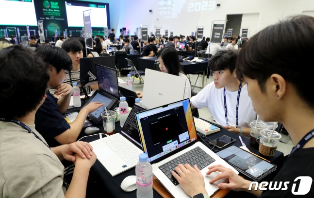
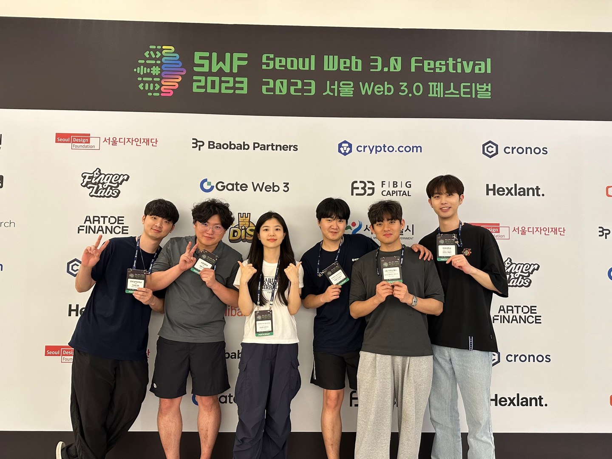

# 협업 역량과 목적성의 필요성

컴퓨터 공학부에서의 학업은 물론, 현업에서도 협업 역량은 필요한 스킬 중 하나입니다. 그런 이유로, 저는 동아리, 해커톤과 같은 팀 프로젝트에 참여하며 협업 역량을 기르는 기회를 많이 찾아봤었습니다.

특히, 최근 참여한 해커톤은 제 역량을 향상시키기 위한 중요한 도전이었습니다. 그런데, 저와 제 팀은 예상치 못한 어려움에 직면하게 되었습니다. 협업을 통해 이뤄내야 하는 프로젝트는 크기가 컸고, 역할 분담의 중요성이 크게 부각되었던 프로젝트였습니다.

사실을 말하자면, 그 어려움을 극복하지 못했습니다. 프로젝트를 제한 시간 내에 성공적으로 완수하지 못한 것이 저희의 결과였습니다. 그럼에도 불구하고, 이 경험에서 중요한 교훈을 얻었습니다.

> 1. 발표를 하는데 있어서 그리고 프로젝트 자체에 있어서 프로젝트의 목적성이 중요하다는 것을 깨달았습니다.

> 2. 팀원 간의 역할 분담의 중요성을 더욱 명확하게 깨달았습니다. 역할 분담이 모호한 상황에서는 혼돈이 늘어나는 것을 몸소 체감했습니다.

또한, 실패는 협업 능력을 향상시키는 기회라는 것을 배웠습니다. 왜냐하면, 실패를 통해 우리는 어떤 부분에서 문제가 발생했는지, 어떤 부분에서 개선할 수 있는지를 돌아보고 더 나은 방향을 모색하는 계기를 갖게 되었습니다.

## 실패와 배움

### 1. 프로젝트의 목적성

저는 프로젝트가 끝난 이후, 과거에 운영한 회사를 아는 형에게 이번 주에 참여한 해커톤에서 상도 못타고 발표도 제대로 하지 못했다고 전화했습니다.
형은 이번 프로젝트가 어떤 프로젝트인지 궁금해하며 더 자세한 설명을 요구해서 저는 다음과 같이 말했습니다.

> "저희 프로젝트는 마켓플레이스인데요, 프롬프트를 NFT로 만들어서 판매하는 플랫폼이에요. 다른 사람들이 직접 프롬프트를 구매하고 판매할 수 있게끔 돕는거죠."

하지만 형은 그게 너무 복잡하고 어렵다며, 아이가 들어도 이해할 수 있는 설명을 요구했습니다. 그래서 1시간의 시도 끝에 저는 서브웨이에서의 경험을 바탕으로 다시 설명을 시도했습니다.

> "저희 서비스는 서브웨이에서 내가 직접 만든 샌드위치를 팔 수 있는 서비스에요. 대신 이건 어떤 조합이던, 어느 사람도 똑같이 만들어낼 수 없는 특별한 샌드위치에요."

형은 그게 그나마 이해하기가 좀 명확하다고 했으며, 나중에는 프로젝트를 시작할 때부터 목적을 명확하게 잡아야 한다고 조언해주었습니다.
내가 말하는게 다른 사람들이 이해하기 어렵다면, 그건 아직 목적성이 명확하지 않아서 그럴 수 있다고 조언해주었습니다.
목적이 명확할때, 다른 사람들에게 알려주는 것도 보다 명확해질거라고 얘기했습니다.
그러니 목적을 정하는 것이 프로젝트의 성패를 결정짓는 중요한 첫걸음이라고 강조했습니다.

결국 프로젝트를 성공시키려면, 기술을 가지고 무엇을 만들 수 있는지 뿐만 아니라 다른 사람들이 이해할 수 있게 설명하는 능력도 중요하다는 것을 배웠습니다.

> "목적이 명확해질 때, 다른사람들에게 알려주는 것도 그러하다는 것을 깨달았습니다."

### 2. 팀원 간의 역할 분담의 중요성

> 기획자 있나요? 디자이너 있나요? 개발자 있나요? 마케터 있나요?"

저희 팀은 총원 6명에 개발자만 5명에 디자이너 1명으로 구성되어 있습니다.

해커톤 준비 기간 그리고 해커톤 대회 기간동안 우리 5명은 대부분의 기간동안 개발에 몰입했으며, 초반에 개발과 디자인에만 몰두한 나머지, 기획에 제대로 힘을 쓰지 못했으며, 2박 3일의 기간동안 발표 전날에도 발표자를 정하지 못했습니다.
결국엔 기획, 발표 등에서 어려움을 맞이할 수 밖에 없었습니다.

지금 생각해보면, 각 개인별로 프로젝트를 하는 목적이 있을 것 같습니다.
누구는 협업 능력을 기르기 위해서, 누구는 발표 능력을 기르기 위해서일 것일 수도 있습니다.

저의 목적은 다른 사람들과 개발 프로젝트를 함께 하고 개발 능력을 위해서 였습니다.
아무래도 저희 팀의 개발자 5명의 목적은 대부분이 동일하지 않을까 싶습니다.

> 각 개인별로 각자의 목적성에 따른 역할에 따른 분담을 정하고, 각자의 목적에 치중하고 몰입하는 것이, 좋은 결과를 낳았을 것이라고 생각합니다.

## 마무리

이 실패를 통해 얻은 교훈을 바탕으로, 더 나은 협업 방식을 구축하고 다음 도전에 임할 준비가 되었다고 생각합니다.
이번 경험을 통해 미래의 프로젝트에서 더 나은 결과를 얻기 위한 길을 찾아가는 방법을 배웠습니다. 실패에서 배운 교훈을 살려 더 나은 협업자로 성장하기 위해 계속해서 노력하겠습니다.

멋진 팀원들과 한 달동안 함께하면서 한 이번 해커톤은 행복한 추억으로 남을 것 같습니다.
이 글을 보실 저희 팀원 그리고 특히 FE팀 지헌님, 성우님 덕분에 많은걸 배웠습니다.
진심으로 감사합니다~!

