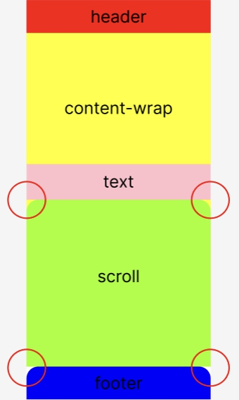
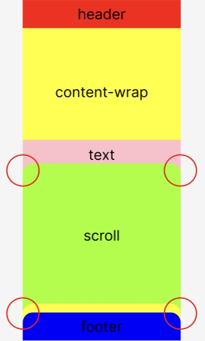
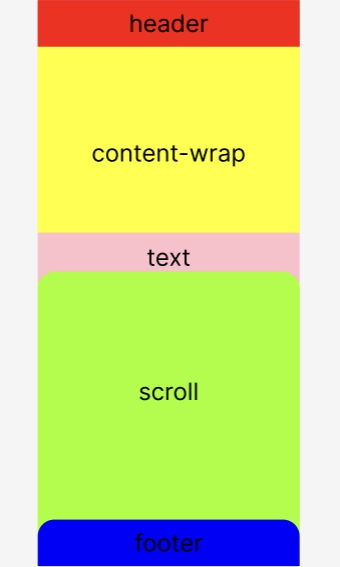

# 나의 인턴 업무 - webView publishing

나는 여러가지 프로젝트를 해봤지만 그래도 지원한 분야가 프론트엔드라 퍼블리싱을 한 경험이 아예 없지는 않다.
최근에 나는 인턴 경험을 하면서도 해당 기업의 서비스 리뉴얼 준비를 위한 모바일 웹 뷰를 퍼블리싱 했다. 나의 미션은 리뉴얼 되기 이전, 기존의 디자인에서 특정 부분들을 새로운 디자인으로 바꾸는 것이다. 평소에 혼자서 구현하는 퍼블리싱은 시간이 걸리지가 않는데, 이번 퍼블리싱은 여러모로 문제가 조금 있었으며, 여기에 그것에 대해서 얘기를 해보려고 한다.

## contents-wrap & border-radius 여백 엎어쓰기

### 요소 설명

모바일 전용으로 보여주는 웹은 하나의 요소 안에서, 3가지 요소들로 이루어져 있었다.
`header`, `contents-wrap`, `footer`이렇게 말이다.
`header`은 모바일 뷰에서 로고, 뒤로가기, 그리고 카테고리 바를 위한 아이콘이 들어간다.
`contents-wrap`은 콘텐츠가 안에 들어가는 부분이다. `text`와 `scroll`이 있다.
`footer`은 `nav bar`이 들어간다.

## 2가지 문제점

이전 디자인과 다르게 바뀌어야 하는 점은, `footer`와 붙어있는 콘텐츠 하단 부분에서 여러 요소들을 스크롤을 하는 부분이다.
`footer`와 붙어있는을 강조하는 이유는, 하단 부분의 nav bar에 `border-radius` 속성 값이 들어가 있고, 이러한 이유로 인해, 콘텐츠가 `footer` 부분에 까지 도달해야 자연스러운 UI를 보여주는 것이 되기 때문이다.
자연스러운 UI를 보여주기 위해서는 두 가지 문제가 해결되어야 한다.

#### 문제점

> `1.` `footer`과 닿아있는 부분의 `border-radius` 여백 부분이 해결되어야 한다.

> `2.` `text`와 닿아있는 부분의 `border-radius` 여백 부분이 해결되어야 한다.

아래 그림의 동그라미 부분들이 해결되어야 자연스러운 UI를 보여줄 수 있다.



### 1번 해결 방법 (하단 동그라미 부분)

하단 여백이 덮어져야 하는 문제점은 `scroll`을 감싸는 `contents-wrap`부분을 `footer`부분까지 늘리는 것으로 즉각 해결이 되었다.


### 2번 해결 방법 (상단 동그라미 부분)

상단 여백이 덮어져야 하는 문제는 `position`속성으로 해결되는 문제가 아니었다.
만일 `position: relative; top: -20px;`으로 프로퍼티를 넣을 경우, `scroll`의 상단 부분은 덮이겠지만 하단 부분이 비게되는 현상이 생긴다. 상대적 배치로 인해서 아래의 사진과 같이, 아랫쪽 부분이 뜨게 되는 현상이 생기는 것이다.

- 아랫쪽이 뜨게 되는 현상



해답을 찾아본 결과 `scroll`요소에 `position`프로퍼티를 사용하지 말고, `scroll`요소 안에 들어가 있는 요소들 중에서 가장 마지막 요소의 `margin-bottom`값을 넓혀서 이러한 문제를 해결할 수 있었다.

같은 계층의 요소들 중에서 마지막 요소를 고르는 CSS는 이렇다.

```css
.scroll-wrap > div:nth-last-child(1) {
  margin-bottom: 50px;
}
```

pseudo class를 사용하며, 그 중에서 nth-child 키워드의 의사 클래스를 사용한다.
여기에 의사 클래스 대해서 개념적인 설명을 하자면,

:nth-child

nth-child(N) 키워드를 가진 의사 클래스는 이 클래스를 적용하는 해당 요소들 중 시작에서 N번째 요소에 CSS를 적용한다는 것을 말한다.
:nth-last-child(N) 키워드를 가진 의사 클래스는 이 클래스를 적용하는 해당 요소들 중 마지막에서 N번째 요소에 CSS를 적용한다는 것을 말한다. 고로 nth-child의 거꾸로 버전이다.
매개변수 N은 숫자가 들어갈 수도 있고, odd와 같은 홀수 짝수 값이 들어갈 수 있다. 혹은 2n + 1처럼 식을 줄 수도 있다.

> 주의

부모 요소가 없을 시, Safari(IOS) 브라우저에는 적용이 되지 않는다. 고로 선택 요소 위에 부모 요소를 넣는 것을 추천한다.

## 결과

결과적으로 상하단 여백 부분을 모두 덮어씌어, 자연스러운 UI 구현이 가능했다.



## 내 생각

이러한 문제점을 경험해 보면서 느끼는 생각은 기존의 디자인 형태가 고정 되더라도,
`header`와 `footer`의 형태가 박스 형태가 아닌 다양한 형태로 바뀔 수도 있다는 것을 고려하여,
만일 `header`와 `footer`의 가로 세로 값이 고정되어 있다면,

`contents-wrap`을 `header`부터 `footer`까지 전부를 아우르게 하고,
위 아래에 `margin`값만 주는 것이 좋다고 생각한다.

그렇게 되면 나중에 `header`나 `footer`의 디자인이 리뉴얼 될 경우, 보다 더 편리하게 CSS를 처리할 수 있을 것이라 생각이 된다.
